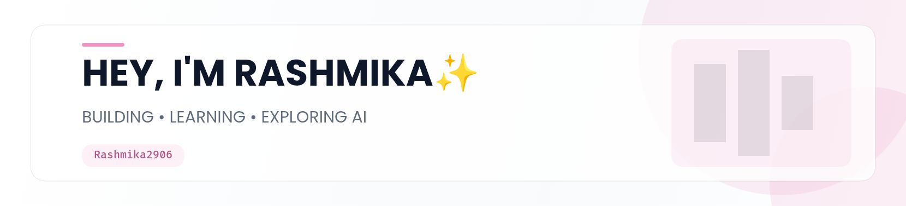

<picture>
   <source media="(prefers-color-scheme: dark)" srcset="art/header-dark.png">
   
</picture>
<h1 align="center">
 Hey there, Myself Rashmika.S😁
</h1>

<i>
⭐Actively building my skills, projects, and journey in tech.
</i>

 

<h2 align="center">About Me💗</h2>
<table align="center">
<tr>
<td width="65%" valign="middle">
### Hi, I'm Rashmika!!

🎓I'm a **3rd-year Computer Science Engineering student** passionate about software development, AI, and building practical technology.

💻I enjoy turning ideas into **real working projects**, from web applications to AI-powered tools.

🤖Currently exploring **Generative AI, LLM's, RAG, Langchain, and full-stack development**.

✨Python is one of my strongest languages, while I'm also strengthening my skills in **Java, C, JavaScript, and web development**.

❤️I believe the best way to learn is to **build, experiment, break things, and build them better**.

🌱Right now, I'm focused on becoming a stronger developer by consistently learning, building projects, and improving my problem-solving skills.
</td>
<td width="35%" align="center">

  

 

 

</td>
</tr>
</table>

 
<h2 align="center">Currently Building🔥</h2>

I'm not just learning - I'm building along the way.

<table align="center">
<tr>
<td align = "center" width="33%">

### 🤖 AI Projects
 Building practical applications using **Generative AI, LLMs, RAG, and AI API's**.
 </td>
 <td align="center" width="33%">

### 💻 Full Stack
Learning how to turn ideas into **complete, usable applications**.
</td>
<td align="center" width="33%">

### 🧠 DSA 
Strengthening my **problem-solving and coding fundamentals** for placements.

</td>
</tr>
</table>
 

<h2 align="center">🛠️ Tech Stack</h2>

<b>AI / GenAI</b>
&nbsp; • &nbsp;
LLMs
&nbsp; • &nbsp;
RAG
&nbsp; • &nbsp;
LangChain
&nbsp; • &nbsp;
Generative AI

 

<h2 align="center">💡 Featured Projects</h2>
<table align="center">
<tr>
<td width="50%" valign="top">

### 🎙️ MeetScribe AI

AI -powered meeting assistant that transforms recorded meetings into useful, structured information.

**Features:**
-🎧 Audio transcription
-📝 AI-generated summaries
-✅ Action items
-🔑 Key decisions
-📧 Follow-up email generation
-🎯 Meeting context support

**Tech:** Python • Flask • Whisper • Generative AI
</td>
<td width="50%" valign="top">

### 📄 AI Resume Analyzer

Ai -powered resume analysis tool designed to help users understand and improve their resumes.

**Features:**
-📊 Resume scoring
-🎯 ATS analysis
-🔎 Missing keywords
-💪 Strength identification
-❓  Interview question generation
-📚 Analysis histry

**Tech:** Python • Streamlit • Gemini API
</td>
</tr>
<tr>
<td width="50%" valign="top">

### 💧 AquaSense

Smart water hydration reminder system built using Arduino and motion sensing.

**Tech:** Arduino Nano • MPU6050 • LCD • Buzzer

</td>
<td width="50%" valign="top">

### 🎮 Unity Multiplayer Game
Currently exploring multiplayer game development with **Unity 6** , working with a team to build a zombie-survival game.

**Tech:** Unity • C# • Game Development 
</td>
</tr>
</table>

 

 

<h2 align="center">📊 Github Analytics</h2>

 

<h2 align="center">📈 Contribution Activity</h2>

 

<h2 align="center">🚂 Contribution Train</h2>

<picture>
<source media="(prefers-color-scheme: dark)"
srcset="https://raw.githubusercontent.com/Rashmika2906/Rashmika2906/output/github-snake-dark.svg"/>
<source media="(prefers-color-scheme-light)"
srcset="https://raw.githubusercontent.com/Rashmika2906/Rashmika2906/output/github-snake.svg"/>

</picture>

 

<h2 align="center">🌱 What I'm Learning</h2>

`Data Structures & Algorithms`
&nbsp; • &nbsp;
`Generative AI`
&nbsp; • &nbsp;
`LLMs`
&nbsp; • &nbsp;
`RAG`
&nbsp; • &nbsp;
`LangChain`
&nbsp; • &nbsp;
`Full Stack Development`
&nbsp; • &nbsp;
`Java`
&nbsp; • &nbsp;
`Cloud & Deployment`
&nbsp; • &nbsp;

 

<h2 align="center">💌 Let's Connect</h2>

 

<i>
✨ Thanks for visiting my profile! Keep building, keep learning. 🔥
</i>

